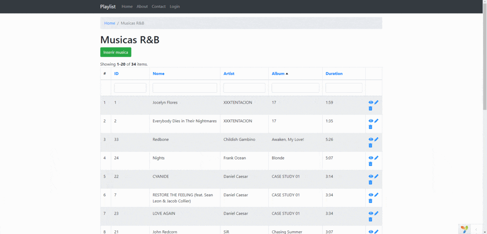

# CRUD-yii2
This repositorie contains a CRUD Application made with the yii2 framework in PHP.

I made this CRUD application based on my R&B playlist to exercise the gii code generator tool. With gii it was generated the files inside the models directory and the files inside the rb directory from views.

It's possible to insert a new music, delete or update an existing one.

